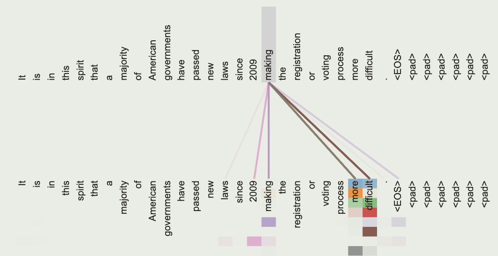

<a href="https://proceedings.neurips.cc/paper_files/paper/2017/file/3f5ee243547dee91fbd053c1c4a845aa-Paper.pdf">论文原文</a>, <a href="https://www.bilibili.com/video/BV1ZG411y7aZ/?spm_id_from=333.788.top_right_bar_window_history.content.click&vd_source=6823fff4176fbb99da705bde30eb8cea">本文引用</a>

# intro

原始的循环神经网络无法处理长距离依赖问题, LSTM 可以改善这一点但做的不够好, 并且它们的网络结构决定了无法进行并行训练

本文提出 Transformer, 完全通过 attention 来处理全局依赖

# process

如上图, 一个 Transformer 可以被分为 encoder(左)和 decoder(右), 假设编码器接受一串文本

- 首先输入会被分解为一段数字, 每个数字代表一个词
- 然后进入嵌入层, 每个表示词的数字会被提升为一个向量, 即用一个向量表示一个词, 向量可以存储更多信息(如空间距离)
- 接着进行位置编码, 将每个词的位置信息与之前的词向量相加
- 接着进入 MHA, 假设输入为 X, 则$Q=XW^Q,K=XW^K,V=XW^V$
- ...

具体计算过程

Positional Encoding:

$$
\begin{aligned}
PE_{(pos,2i)}&=sin(pos/10000^{2i/d_{model}})\\
PE_{(pos,2i+1)}&=cos(pos/10000^{2i/d_{model}})
\end{aligned}
$$

Multi-Head Attention:

$$
\begin{aligned}
	MultiHead(Q,K,V)&=Concat(head_1,\dots,head_h)W^O\\
	where\space head_i&=Attention(QW_i^Q,KW_i^K,VW_i^V)
\end{aligned}
$$

多头注意力机制, 每一个注意力通过不同的权重矩阵关注不同的信息, 每个注意力可以并行计算

Scaled Dot-Product Attention:

$$
Attention(Q,K,V) = softmax(\frac{QK^T}{\sqrt{d_k}})V
$$

等效为$softmax(XX^T)X$

- 对于$XX^T$, 将X视为一些行向量(词向量)组成的矩阵, 它乘上自己的转置相当于不同词的内积, 即两个向量之间的夹角或者说投影面积, 这个值越大可以理解为相关度越高, 注意力机制要做的就是根据这个相关度给予不同的权重
- 接着通过softmax将一个词与其他各个词的内积转换为概率, 然后用概率乘上原始矩阵就是新的词向量, 是原词向量经过注意力机制加权求和后的结果

(Attention-Visualization)

图中的彩色线条就是对应的 softmax 后的概率(权重), softmax 用于归一化, 原词向量等于原矩阵各词向量加权求和的结果, 权重来源向量内积, 与上述数学公式一一对应, QKV 就是在 X 基础上引入可训练参数, 提高模型拟合能力

Positon-wise Feed-Forward Networks:

$$
FFN(x)=max(0,xW_1+b_1)W_2+b_2
$$

两个线性变换夹一个 ReLU

解码器通过掩码保证只关注前面已经生成的文本

