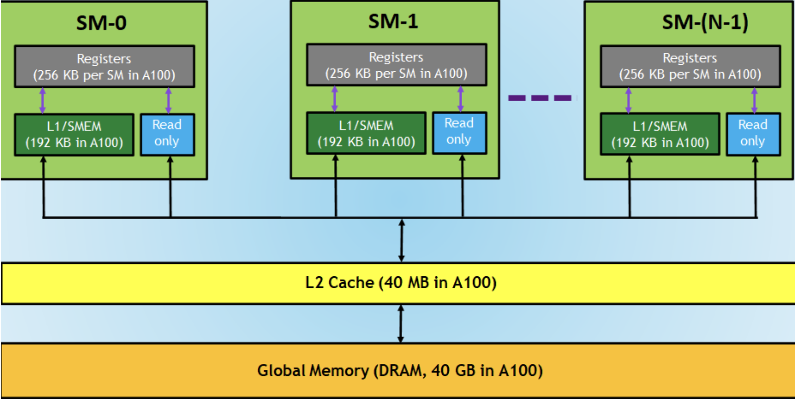
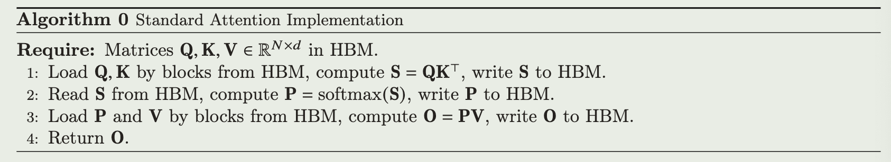
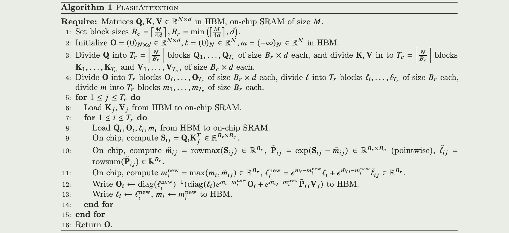

<a href="https://proceedings.neurips.cc/paper_files/paper/2022/file/67d57c32e20fd0a7a302cb81d36e40d5-Paper-Conference.pdf">论文原文</a>, 本文引用<a href="https://wiki.lcpu.dev/zh/hpc/from-scratch/cuda">1,</a><a href="https://zhuanlan.zhihu.com/p/668888063">2</a>

# intro

由于Transformer模型的自注意力方法时空复杂度包含序列长度的平方项, 即使模型变得更大更深也难以处理长上下文

为此, 很多方法试图通过用其它方法去近似Attention的计算来降低时空复杂度, 包括稀疏近似(sparse-approximation), 低秩近似(low-rank approximation)以及一些融合项

尽管以上方法将算法本身计算时间复杂度降到$O(n)$或者接近$O(n)$, 但实际运行时间并没有减少, 这是因为它们忽略了访存延时, 由于GPU的强大计算性能, 访存在GPU算法中尤为重要

本文提出FlashAttention, 在一个GPU kernel(CUDA)上实现了完整的Attention算法, 通过对访存的细粒度控制实现了加速

# memory-hierarchy on GPU

对于访存占用大部分运行时的任务(memory-bound), 优化访存(减少访存次数, 利用缓存等等)更为重要, 但是在现有深度学习框架中无法对内存访问有细粒度(fine-grained)的控制

(memory-hierarchy)

在GPU中, 一般可以将内存分为以下几种(按访问速度升序):

- Global Memory (DRAM), 显存, 相当于CPU的内存
- L2 Cache (SRAM,包括以下), 显存的缓存, SM之间共享
- L1 Cache/Shared Memory, 一些架构中L1 Cache和共享内存共享同一片物理内存, 其中L1 Cache是对L2 Cache/GM的缓存, Shared Mem是编程控制(比如CUDA的\__shared__)的
- Register, 每个线程的寄存器

# Standard Attention Implementation

标准的Attention计算过程$(Q,K \in \mathbb{R}^{N\times d})$

$$
S = QK^T \in \mathbb{R}^{N\times N}, P = softmax(S)\in\mathbb{R}^{N\times N}, O = PV \in \mathbb{R}^{N\times d}
$$

(standard attention)

其中:

- N: 序列长度
- d: 隐藏层神经元数量(W矩阵宽度 $Q\in \mathbb{R}^{N \times d} = XW^Q, X\in \mathbb{R}^{N \times x}, W^Q\in \mathbb{R}^{x \times d}$)

计算可得:

$$
HBM\space Access = \Theta(Nd + N^2) 
$$

# FlashAttention Implementation

主要方法(目标是减少全局内存-论文中称HBM(high band-width memory)的访问):

- Tiling(forward): 将需要计算的QKV矩阵进行分块, 每次将一块QKV从HBM读到片上内存(on-chip SRAM, 应该是shared mem), 然后计算得到一个局部解存回HBM, 重复这个循环

  对于一次读进来的一块数据, 在kernel中将Attention所需要所有处理都一次性完成, 也就是将Attention中的操作序列(标准Attention的计算公式)中的三步合成一步, 在PyTorch中可能是三个算子(MatMul, Softmax(可能是更小的算子), MatMul), 这样就减少了频繁的HBM存取放回

- Recomputation(backward): 之前Pytorch中的算子在反向自动微分时需要原矩阵信息, 这就需要使用到QKV和中间表示SP, 在Standard Attention中SP是保存在HBM中的, 本文中不保存这个SP也就减少了IO, 而是通过QKV重新把SP计算出来, 这个过程的耗时小于IO

(flashattention)

其中:

- $m,\ell$ 用于下文From Online Softmax to FlashAttention

计算可得:

$$
\begin{aligned}
HBM\space Access &= T_c \times (B_c\times d + T_r\times (B_r \times d))\\
&= \frac{N+B_c}{B_c}\times Nd\\
&= (1+\frac{Nd}{M})\times Nd\\
&= \Theta(\frac{N^2d^2}{M})
\end{aligned}
$$

HBM Access的理论下界是当$M=\Theta(Nd)$时, 即可以将整个QKV矩阵存入SRAM时, HBM Access = $\Omega(Nd)$

# From online softmax to FlashAttention

一个关键点在于softmax依赖于一个全局的分母项, FlashAttention的一个核心思想就是将算法本身与这个全局依赖解耦, 从而使用Tiling实现快速的片上计算

(from 3-pass (safe)softmax to 2-pass softmax)
(from 2-pass attention to 1-pass attetion(FlashAttention))

具体过程参考: <a href="https://courses.cs.washington.edu/courses/cse599m/23sp/notes/flashattn.pdf">pdf</a>, <a href="https://wenqingqian.github.io/assets/pdf/flashattention.pdf">blog</a>
