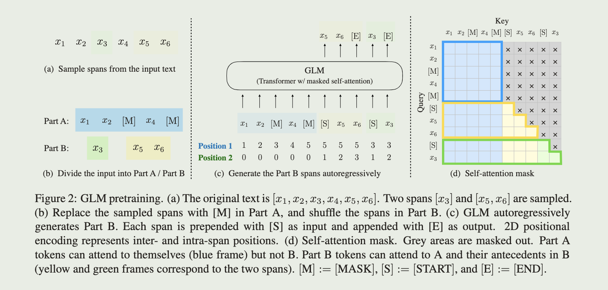
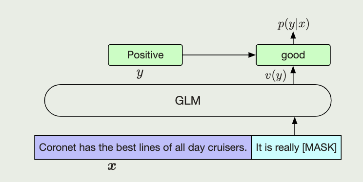

<a href="https://arxiv.org/pdf/2103.10360.pdf">论文原文</a>

# intro

NLP任务通常分为三类:

- natural language understanding(NLU): 文本分析
- Unconditional generation: 文本生成
- Conditional generation: 翻译, seq2seq

预训练模型也通常分为三类:

- autoregressive: GPT

  从左往右学习, 在长文本生成任务中很成功, 但由于单边注意力机制, 在NLU任务中无法完全捕获词间依赖

- autoencoding: BERT
  
  双边注意力机制, 适合NLU, 但无法直接应用于文本生成

- encoder-decoder: T5

  encoder采用双边注意力机制, decoder采用单边注意力机制, 用交叉注意力连接, 可以用于NLU和condGen任务但需要更多的参数

  由于自回归和自编码的本质区别, 难以简单继承两者的优点

本文提出GLM(General Language Model), 基于空白段自回归, 来实现一个通用语言模型应对所有的NLP任务

# pretrain

通过对输入序列的随机连续段进行掩盖(blank infilling)(autoencoding), 然后训练模型重建这个序列(autoregressive)

对于blank infilling, 与T5不同, 本文做了以下两个improvements:

- 空白段乱序预测
- 2D位置编码

此外, 本文受<a href="https://arxiv.org/abs/2012.11926">Pattern-Exploiting Training (PET)</a>启发, 将NLU问题视为可以用自回归生成的完形填空问题

## Mask

其中:

- Part A: mask后的序列

- Part B: 被mask的段

- (c): 对Part B进行打乱, 对每一个段填充特殊的[START]和[END] token

- 通过掩码注意力机制, Part A可以关注A中全部信息(蓝框), 但不能关注B(黄绿)

  Part B可以关注A(蓝)和B中自己的前置词(黄色段不能看绿色, 绿色可以看黄色)

  借此模型就可以自动学习到一个双边编码器和单边解码器

## 2D Position Encoding

图(c)中的位置编码, 其中:

- Position 1: 片段在原始文本的位置

  A中mask等同token编码, 即一个mask段与token在位置编码上是相同的单位, mask段中的tokens(B)共享与mask段在A中相同的Pos1

- Position 2: 片段内词的相对位置

  A中的token包括mask的Pos2为0

这样编码的好处是模型无法意识到mask段的长度, 因为生成文本的长度一般是事先未知的

## Multi-Task Pretraining

对于不同任务的训练, 只需要调整mask段的长度和数量

- NLU: 通过短mask段
- uncondGen(文本生成): 单一的长mask段, 长度服从整个序列长度50%-100%的均匀分布
- condGen(seq2seq): mask段被限制为一个完整的句子, mask段长度和为原始序列的15%

## Model Architecture

- 重排残差连接和层归一化的顺序
- 使用单个线性层做预测
- 使用GeLUs代替ReLU

## Finetuning GLM

(formulation of the sentiment classificationtask as blank infilling with GLM)

对于NLU任务, 通常做法是用一个线性分类器将预训练模型产生的序列的 embedding 作为输入,并预测正确的标签

GLM 将 NLU 分类任务看作完形填空

给定一个标记的示例 $(\boldsymbol x,y)$, 可以将 $\boldsymbol x$ 通过一个模板将其转化为一个完形填空问题 $c(\boldsymbol x)$

对于情感分类问题可以用图中的"{SENTENCE}. It's really [MASK]"模板, 同时将候选标签 $y$ 映射到填空答案 $v(y)$, 这里是$y\in (positive, negative)\to v(y)\in (good, bad)$
