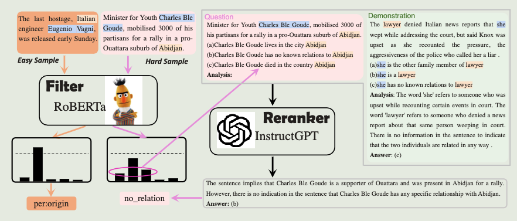

<a href="https://arxiv.org/pdf/2303.08559.pdf">论文原文</a>

# intro

本文回答以下四个问题:

- LLMs在few-shot IE (Information Extraction) 任务中是否比Small Language Models(SLMs)表现更好
- 更多的标注数据能否增强LLMs和SLMs
- 如何取舍金钱和时间成本
- LLMs和SLMs是否分别擅长处理不同类别的样本

实验结果显示:

- 只有当标注数据数量受限时(每个标签的类别和样本稀缺) LLMs 比 SLMs 好 

  当样本增多时, SLMs超过LLMs, 可能的原因是:

  - 由于ICL (in-context-learning) 最大输入长度限制, 只有一小部分样本可以用作prompt demos
  - 标签类别增加导致 prompt 中每个标签的样本数减少

- LLMs比finetuning SLMs 有更高的推理延迟, 尤其是当 ICL 的 demos 很长

- LLMs更适合 hard samples (LLMs有更多的知识) 而不是 easy samples (SLMs 经过微调)

# filter-then-rerank

(overall architecture of our adaptive filter-then-rerank paradigm)

基于上述实验结果(总结):

- (1)表述了在更多训练样本和复杂模式下的SLMs IE效果更好
- (2)表述了SLMs更轻量级

本文提出自适应 filter-then-rerank 框架, 融合了SLMs和LLMs, 其中:

- SLMs作为filter
- LLMs作为reranker

SLMs提取N个可能性最高的候选, 对于无法顺利处理的样本, LLMs重新排序这N个标签并生成结果

具体的rerank过程:

- 使用类似如下多项选择题式的 prompt模板
- 具体的, 这个示例模板描述两个"entity"之间具有"label"关系, 生成选项后由LLMs做出选择

(other example)

这种模板的优点在于:

- 缩小标签范围
- 降低IE任务复杂度, 因为LLMs对这种格式更熟悉
