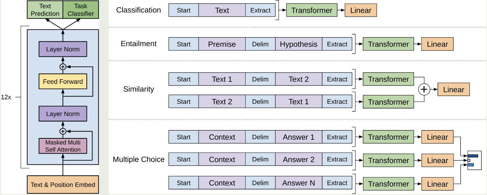

<a href="https://www.mikecaptain.com/resources/pdf/GPT-1.pdf">论文原文</a>

# intro

由于标记语料数据的稀缺, 使得基于判别式训练的模型难以有足够的性能

但是丰富的未标记的语料库提供了另一种可能:

- 通过在多样化的未标记文本语料库上进行语言模型的生成式预训练(Generative Pre-Training)
- 然后对每个特定任务进行判别式微调(discriminative finetuning), 可以实现效果大幅提升

而从未标记语料中提取出超越词级的信息有以下两个挑战:
- 尚不明确哪种类型的优化目标对于学习利于转移的文本表示更有效
- 对于如何高效的转移学习到的表示到目标任务仍未有共识

本文提出一种用于语言理解任务的半监督方法:

- 结合无监督预训练和有监督微调
- 目标: 学习一种通用表示, 几乎不需要调整就可以迁移到广泛的任务上
- 数据集: 大量未标注的文本和几个目标任务相关的带有手动标注训练示例的数据集

具体的:

- 在未标注数据上初始化神经网络模型参数
- 使用有监督目标来调整这些参数以适应目标任务

# model and framework

## unsupervised pre-training

对于给定未标记语料$\mathcal U= \{ u_1,\dots,u_n \}$, 模型的目标是最大化这个似然函数:

$$
L_1(\mathcal U)=\underset{i}{\sum} log\space P(u_i|u_{i-k},\dots,u_{i-1};\Theta)
$$

其中:

- k: 上下文窗口大小

GPT 基于Transformer的decoder, 输入上下文得到预测结果分布

具体的:

$$
\begin{aligned}
h_0 &= UW_e+W_p\\
h_l &= transformer\_block(h_{l-1}\forall i\in [1,n])\\
P(u) &= softmax(h_nW_e^T)
\end{aligned}
$$

其中:

- U: 上下文
- n: 层数
- $W_e$: token embedding matrix
- $W_p$: position embedding matrix

## supervised fine-tuning

对于标注数据集$\mathcal C$, 有:

$$
P(y|x^1,\dots,x^m)=softmax(h_l^mW_y)
$$

$$
L_2(\mathcal C)=\underset{(x,y)}{\sum}log\space P(y|x^1,\dots,x^m)
$$

# Task-specific input transformations

对于一些特殊的任务, 比如QA(question&answer)之类有一定结构形式的文本, 可能需要一些额外的处理

模型是在连续文本上训练的, 对于这些结构式可以通过加入一些特殊的分隔符(开始, 结束, 分隔)来转为模型可以处理的有序序列

