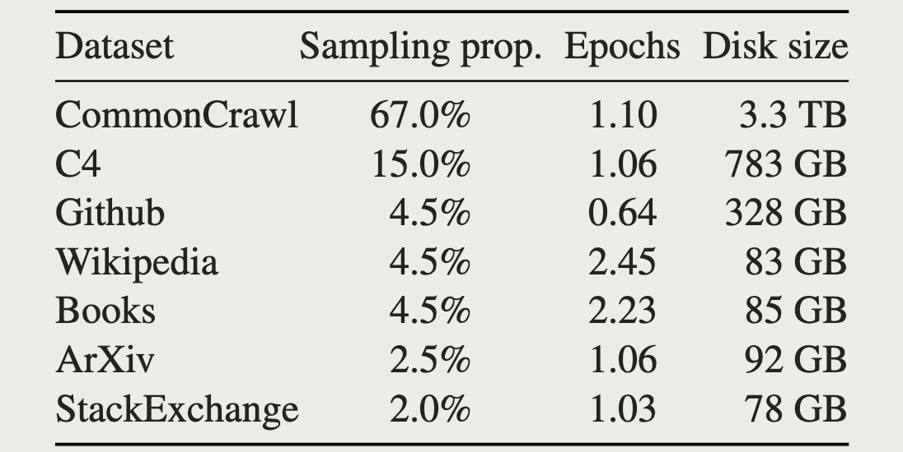

<a href="https://arxiv.org/pdf/2302.13971.pdf">论文原文</a>,

# intro

GPT-3 将模型参数扩大到175B, 在此基础上得到了可以用few-shot得到很好结果的实践依据, 这导致一些工作关注继续扩大参数, 认为更多的参数会有更好的效果

但是, 近期工作显示:

- 在固定的计算负载上(训练所需资源):

  更多数据训练的小模型比更少数据训练的大模型要好

- 在固定的性能上:

  大模型训练到给定性能比小模型要快(小模型需要更多数据)

  小模型推理速度比大模型快

本文目标是训练一系列针对特定推理速度下最好的模型, 并得到了LLaMA, 从7B到65B参数的模型, 性能与SOTA模型相当

# Approach

## Pre-training Data

训练所需所有数据集都是开源的

(Pre-training Data)

## Tokenizer

使用 byte-pair encoding (BPE) (Each step replaces the most common pair of adjacent data units with a new unit that does not appear in the data, and iterates repeatedly, e. GPT2-4, LLaMA), Sentence-Piece (Encode characters in unicode mode and convert all input, whether it is English, Chinese or other languages, into unicode characters, solving the problem of different encoding methods in multiple languages. Encode spaces as ‘_’ to handle differences in space characters when decoding in different languages)

将所有数字分解为独立个体, 将不认识的UTF-8字符分解为byte

## Architecture

- Pre-normalization [GPT-3]
- SwiGLU activation function [PaLM]
- Rotary Embeddings (RoPE) [GPTNeo]
- AdamW optimizer

## Efficient implementation

- 使用xformers高效的causal multi-head attention算法
- 通过checkpoint保存一部分计算量较大的activation, 减少backward时的重复计算
- 尽量并行activation的计算和GPUs的通信
