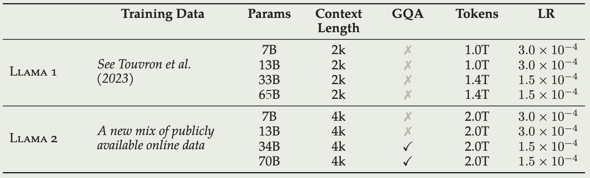
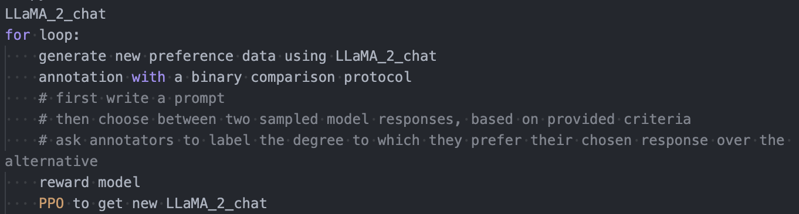
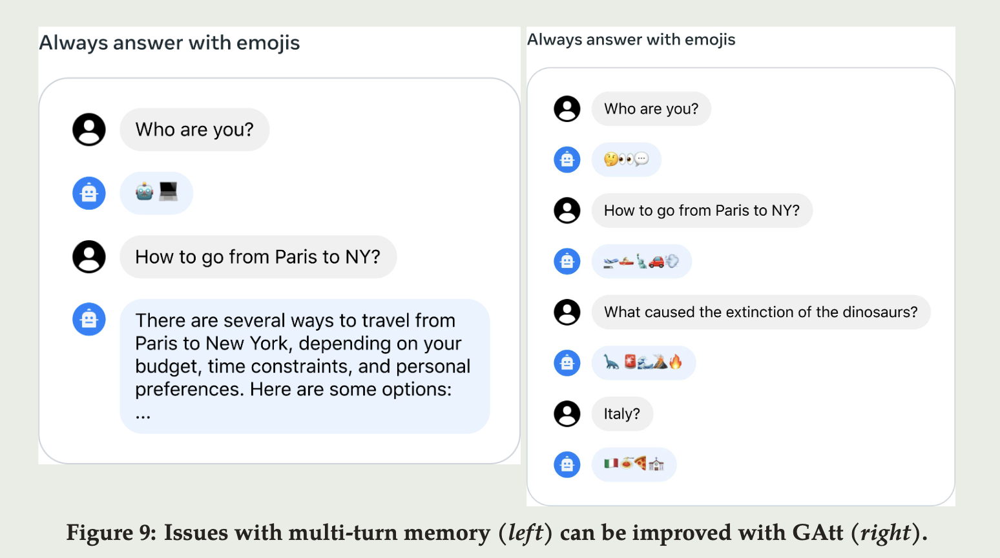

<a href="https://arxiv.org/pdf/2307.09288.pdf">论文原文</a>, <a href="https://www.interconnects.ai/p/llama-2-part-2#%C2%A7ghost-attention-chat-trick">本文引用</a>

# intro

本文介绍LLaMA 2/2-Chat, 最好的[19 Jul 2023]开源对话 fine-tuned LLM, 性能与一些闭源模型(ChatGPT)相当

本文将同时介绍在模型上进行微调, 提高安全性的具体方法

# Pretraining

跟LLaMA的区别:

- 训练数据增加40%, 上下文长度翻倍
- 注重安全和隐私, 对训练数据进行清洗, 包括去除一些来自含有个人隐私的网站的数据
- 对于含有事实的数据进行上采样来增强知识, 抑制幻觉 (hallucinations)
- 使用 grouped-query attention (GQA, 一种介于MHA和MQA之间的方法), 提高推理可扩展性
- RLHF: LLaMA 2-Chat版本即LLaMA 2的微调版本使用人类反馈强化学习

# Fine-tuning

LLaMA 2-Chat = LLaMA 2 + instruction tuning + RLHF

(Training of LLaMA 2-CHAT)

## Supervised Fine-Tuning

Quality Is All You Need, 用于SFT的数据的质量比数量更重要

## RLHF

RLHF的过程是使模型对齐人类偏好

### Reward Model

- 输入模型回复和prompt, 输出表示质量的标量值
- 使用两个独立的rm, 一个表示有用, 一个表示安全
- 使用预训练模型checkpoints初始化

### Iterative Fine-Tuning

first Rejection Sampling fine-tuning then Proximal Policy Optimization (PPO)

强化学习内容暂时不看

## System Message for Multi-Turn Consistency

为了让指令不会再几轮对话后丢失, 本文提出GhostAttention

类似一种上下文蒸馏技术, 在长prompt上训练模型, 在提取的短prompt上运行SFT, 具体的(猜测):

- 对于一个对话数据 $[u_1,a_1,\dots,u_n,a_n]$,  将指令 $inst$  拼接到所有的u后面
- 通过RLHF对这个合成数据进行采样, 此时的结果是符合指令的多轮对话数据(此时的prompt应该是提取好的短prompt), 去掉除$u_1$之外所有的$inst$
- 使用此数据进行指令微调, 将中间轮次的损失设置为0 
