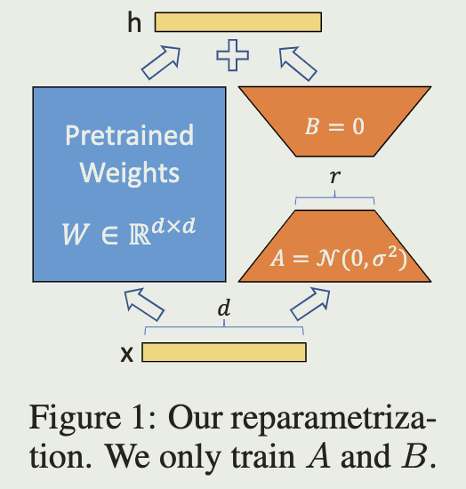

<a href="https://arxiv.org/pdf/2106.09685.pdf">original paper</a>

# intro

Here are some flaws of existing techniques:

- Adapter Tuning: introduce inference latency by extending model depth
- Prefix Tuning: reduce the model's usable sequence length

We take inspiration from previous work (hypo):

- the learned over-parametrized models in fact reside on a low intrinsic dimension

propose Low-Rank Adaptation (LoRA) approach

# Approach

we use low-rank matric to replace the pre-trained weights, specially:

- add new matrices AB next to the pre-trained weights which looks like the ResNet

- frozen the pre-trained weights, use AB as the trained parameters

- modify forward pass as

  $$h=W_0x+BAx$$

  while:

  - pre-trained weights: $W_0\in \mathbb R^{d\times k}$
  - input: $x$
  - $B\in \mathbb R^{d\times r}$, $A\in \mathbb R^{r \times k}$, rank $r\ll min(d,k)$

- use $W=W_0+BA$ as weights when inference

- when switch to another downstream task, recover $W_0$ by subtracting BA and adding new B'A'

We use a random Gaussian initialization for A and zero for B, so ∆W = BA is zero at the beginning of training  
