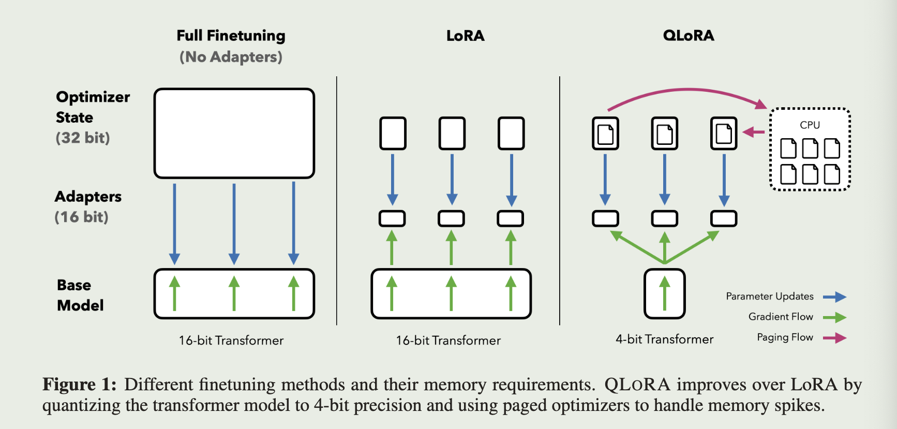

<a href="https://proceedings.neurips.cc/paper_files/paper/2023/file/1feb87871436031bdc0f2beaa62a049b-Paper-Conference.pdf">original paper</a>

# intro

QLoRA introduces a number of innovations to save memory without sacrificing performance:

- 4-bit NormalFloat (NF4)
- Double Quantization
- Paged Optmizers

# Approach

## Block-wise k-bit Quantization

Quantizing FP32 to Int8 with range [-127,127]

$$
X^{Int8}=round\left(\frac{127}{absmax(X^{FP32})}X^{FP32}\right)=round(c^{FP32}\cdot X^{FP32})
$$

$$
dequant(c^{FP32},X^{Int8})=\frac{X^{Int8}}{c^{FP32}}=X^{FP32}
$$

Chunking the input into independently quantized blocks with their own $c$ to reduce the influence of large magnitude value which will lead the other value to be too small

## Quantile quantization

For k-bit quantile quantization:

- sort the data
- divide data into $2^k$ equal parts
- each data have its own index $i\in [0,2^k-1]$

store the data with this index, and recovered by follow function in calculation:

$$
q_{i} = \frac{1}{2}\left(Q_X\left(\frac{i}{2^k+1}\right)+Q_X\left(\frac{i+1}{2^k+1}\right)\right)
$$

while $Q_X(\cdot)$ is the quantile function of the empirical cumulative distribution, i.e., $Q_X(0.5)$ means the median of distribution

## NormalFloat

while the process of quantile estimation which include sort and divide is expensive, actually, the pre-trained nn weights usually have a zero-centered normal distribution with standard deviation $\sigma:N(0,\sigma^2)$

assuming $\sigma = 1$, in this case:

- estimate the $2^k+1$ quantiles of $N(0,1)$ distribution through equation (3)
- normalize these $2^k+1$ quantiles into [-1,1]
- Finally directly quantize the input by normalizing it into the [-1,1] range through absolute maximum rescaling

In other words:

- step 1: we can get the certain quantiles without the data but through the distribution
- step 2: we can get the normalized certain quantiles
- step 3: after this step, input and quantiles have the same scale that we can easily get the index $i$ through comparison

we only need do step 3 each time

A problem is no exact representation of 0, which may have the special means

TODO(something not understand):

- why estimate $2^k+1$ quantiles, $2^k-1$ are enough to divide data into $2^k$ parts
- the equation (3), what does $i$ mean and its range
- zero representation method

## Double Quantization

In Block-wise k-bit Quantization, each block have a quantization constant $c^{FP32}$, assum block size is $b_1$

$$
bits\space per\space parameter=k+(\frac{32}{b_1})
$$

we can quantize the $$c^{FP32}$$ to $$c_2^{FP8}$$, by chunking the $$c^{FP32}$$ with block size $$b_2$$

$$
bits\space per\space parameter=k+\frac{8}{b_1}+\frac{32}{b_1*b_2}
$$

## Paged Optimizers

Transfer the optimizer states from GPU to CPU RAM when GPU runs out-of-memory and paged back into GPU when it is needed