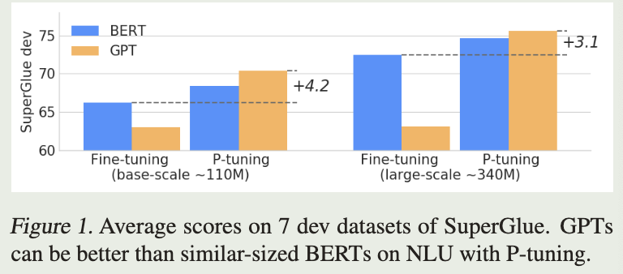
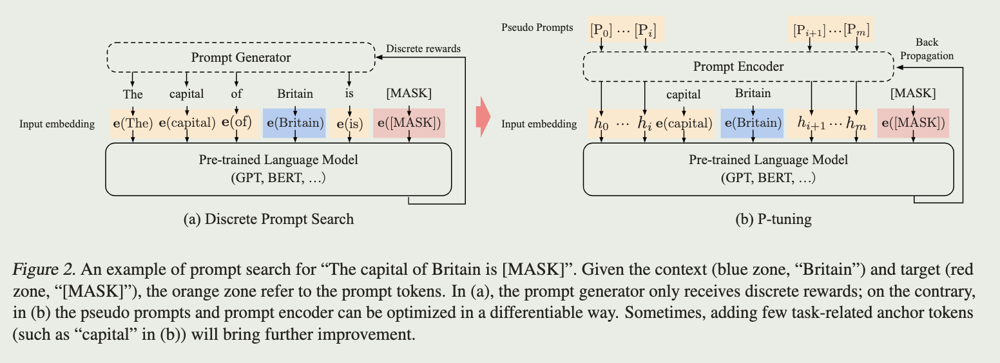

<a href="https://www.sciencedirect.com/science/article/pii/S2666651023000141">original paper</a>, <a href="https://kexue.fm/archives/8295">reference</a>

# intro

In the past, we leverage handcrafted discrete prompts to steer the model for downstream applications, however, its performance is volatile since a single-word change in prompts could yield a drastic difference

We propose P-Tuning:

- automatically search prompts in the continuous space
- with this method, GPTs can be better than BERTs on NLU, however, p-tuning also serves as a general method

# Approach

## automatically prompt generate

(discrete or continuous?)

Use trainable embedding tensor to find continuous prompts instead of traditional discrete prompts

## association

considering the prompt should be dependent on each other, we need some mechanism to associate prompt 

we use LSTM as prompt encoder which is beneficial to convergence and performance to generate the prompt instead of embedding 

## process

- design the template for special task

  template include virtual tokens (orange zone), fixed discrete prompts (blue zone)

- trainable prompt encoder (LSTM)

- back propagation to update the virtual tokens

- concatenate discrete prompts with optimized virtual tokens and discard the encoder in the inference

## Fine-tune

in many-shot: searching the prompts and fine-tuning are conducted simultaneously

in few-shot: searching the prompts and frozen the weights
