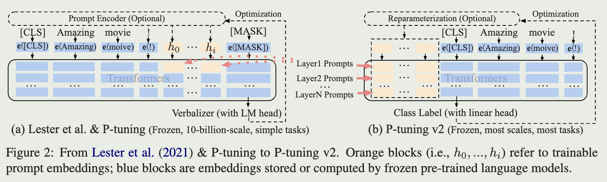

<a href="https://arxiv.org/pdf/2110.07602.pdf">original paper</a>

# intro

P-Tuning v2 is an optimized and adapted implementation of Prefix Tuning in NLU tasks and achieve the effect of fine-tune, which surpasses the prompt-tuning and p-tuning

# Background

Lack of universality across scales:

- prompt-tuning can be comparable to fine-tuning when the model scales to over 10B but perform much worse for medium-sized models (from 100M to 1B)

Lack of universality across tasks:

- prompt-tuning and p-tuning perform poorly  on sequence tagging tasks (due to verbalizers)

Lack of tunable parameters:

- prompt-tuning and p-tuning only insert continuous prompts into the input embedding sequences, which lead to:
  - limited tunable parameters due to constraints of sequence length
  - no direct impact on model predictions

# Optimization and Implementation

The prompts will be inserted into KV matrices for each transformer

## Reparameterization

prompt-tuning use MLP and p-tuning use LSTM as reparameterization encoder, however, its usefulness depends on tasks and datasets in NLU

## Prompt length

different NLU tasks achieve their best performance with different prompt length

## Classification Head

P-Tuning v2 applies a randomly-initialized classification head instead of verbalizers due to its uselessness in full-data setting

