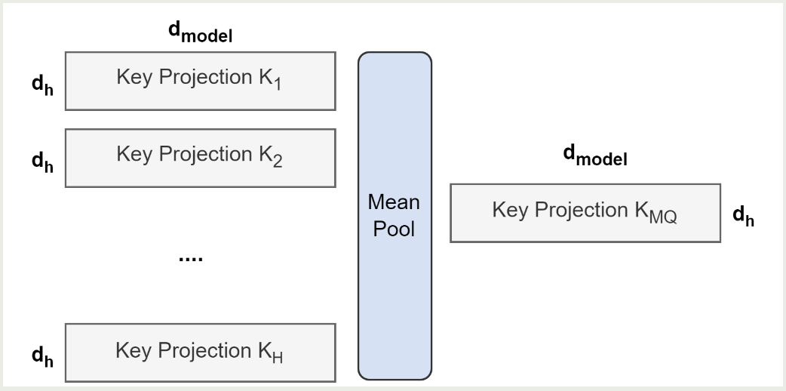
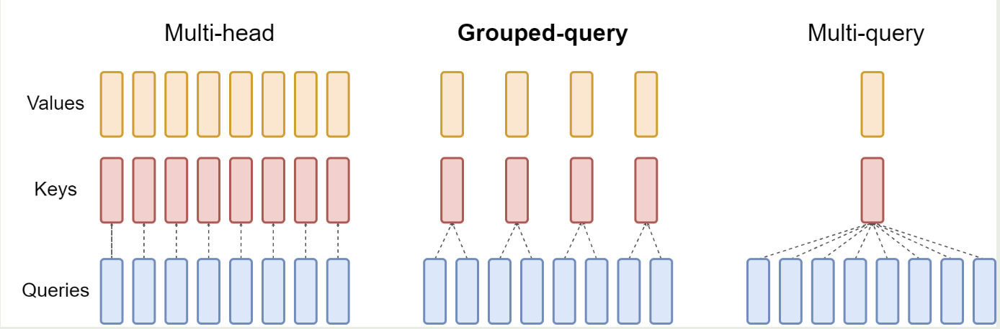

<a href="https://arxiv.org/pdf/2305.13245.pdf">论文原文</a>

# intro

two contributions:

- method for converting MHA checkpoint to MQA checkpoint
- propose GQA: an interpolation between MHA and MQA

# Approach

## checkpoint convert

apply mean pool instead of selecting a single kv or randomly initializing

## GQA

The quality of GQA is close to MHA when its speed is close to MQA

It cant be applied to encoder which is computed in parallel
