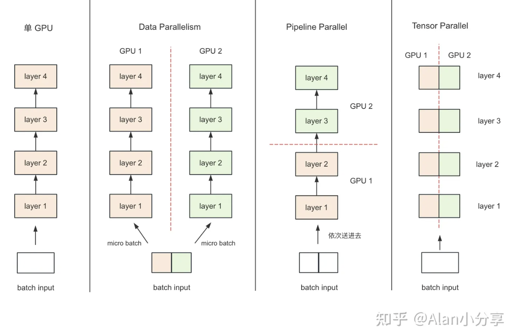
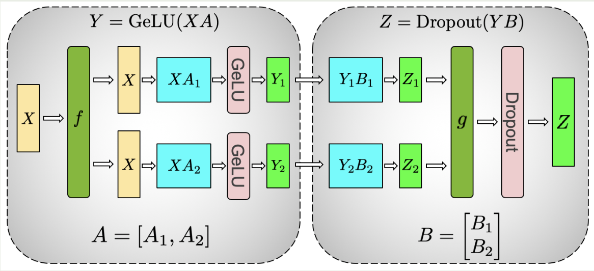
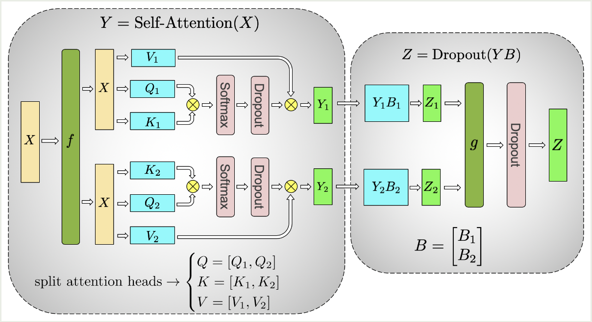
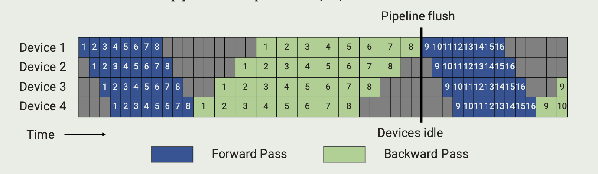
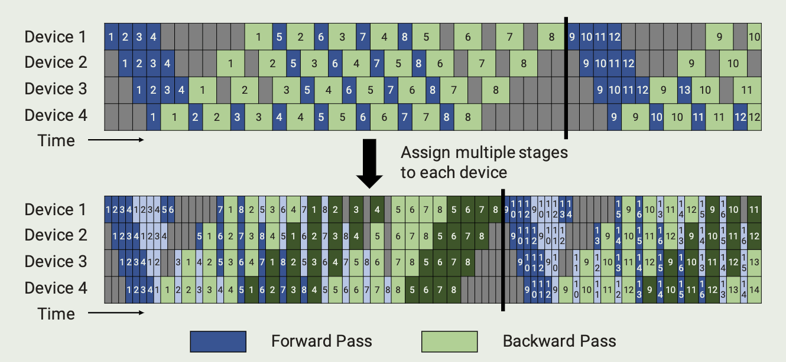
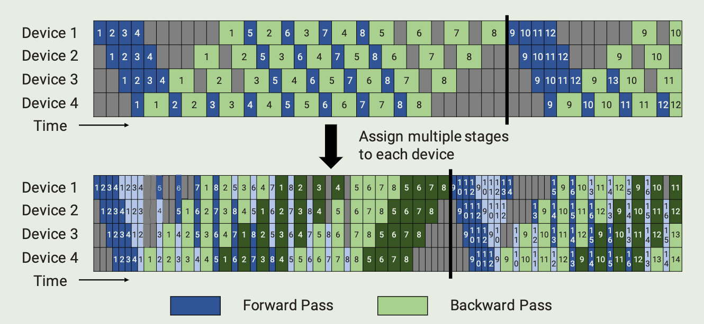

Paper: 

<a href="https://arxiv.org/pdf/1909.08053.pdf">Megatron-LM: Training Multi-Billion Parameter Language Models Using Model Parallelism</a>

<a href="https://doi.org/10.1145/3458817.3476209">Efficient large-scale language model training on GPU clusters using megatron-LM</a>

<a href="https://github.com/NVIDIA/Megatron-LM">Github</a>

# Introcution

NVIDIA Megatron-LM is a distributed training framework based on PyTorch, used to train LLMs based on Transformer. Megatron-LM comprehensively applies data parallelism, tensor parallelism and pipeline parallelism.

# Parallelism

## Data Parallelism

### Data Parallelism (DP)

- Each GPU load the complete model
- Split batch to $$N$$ (the number of GPU) micro-batch and each GPU get a micro-batch
- Each GPU performs complete operations and send the gradient to server:
  - server: dedicated to receiving the gradients, adding them up and sending to each GPU
- Update the parameters in each GPU

### Distributed Data Parallelism (DDP)

<a href="https://arxiv.org/pdf/2006.15704.pdf">PyTorch Distributed: Experiences on Accelerating Data Parallel Training</a>

At step 3, no longer use a dedicated node to perform these operations, as this would make the bandwidth of node a bottleneck, instead,  the ring all-reduce is used to enable each node to participate the process

See <a href="https://oneflow2020.medium.com/how-to-derive-ring-all-reduces-mathematical-property-step-by-step-9951500db96">ring all-reduce’s mathematical property</a>

### ZeRO (Intro)

At step 1, instead of loading the complete model in each GPU, the parameters are split to $$N$$ parts so that each GPU can only store partial parameters and obtain the complete patameters through all-gather when needed

## Model Parallelism

memory usage and computation is distributed across multiple workers

There are two further paradigms:

- (TMP) Tensor Model Parallelism
- (PMP) Pipeline Model Parallelism

# Model Parallel Transfromers

## TMP Transformer

### MLP

$$
XA = X[A_1,A_2]=[Y_1,Y_2]
$$

$$
[Y_1,Y_2]\left[\begin{matrix}B_1\\B_2\end{matrix}\right]=Y_1B_1+Y_2B_2
$$

### Self-attention

Split by column parallel, use all-reduce after all operations

### Embedding

parallelize the input embedding weight along the vocabulary dimension $E=[E_1,E_2]$ and fuse the $[XE_1,XE_2]$ with cross entropy loss

## PMP Transformer

### GPipe

(GPipe)

In this example, divide transformer in 4 group evenly and assign each group to a device, and each batch consists of 8 microbatches

i.e., 16 transformer layer, Device 1: $layer_{0\to3}$ ...

For convenience: 

- $p$: pipeline stage, the number of layer group which is the same as the device
- $m$: the number of microbatches
- $t_{id}$: time of ideal iteration
- $t_{pb}$: time of pipeline bubble
- $t_f$: time of forward pass in single microbatch execution
- $t_b$: time of backward pass in single microbatch execution
- btf: bubble time fraction

GPipe proposes a schedule where the forward passes for all microbatches in a batch are first executed, followed by backward passes for all microbatches

$$
btf=\frac{t_{pb}}{t_{id}}=\frac{(p-1)(t_f+t_b)}{m(t_f+t_b)}=\frac{p-1}{m}
$$

To reduce the btf, we need $m\gg p$, but each device need to stash at least $m$ activations for backward

### Pipedream

(PipeDream to VirtualPipeline)

Fine adjustments are made to the order of forward and backward, which called 1F1B pipeline schedules

$$
btf=\frac{t_{pb}}{t_{id}}=\frac{(p-1)(t_f+t_b)}{m(t_f+t_b)}=\frac{p-1}{m}
$$

It doesnt reduce the bubble time fraction, however, each device need to stash at most $p$ activations, which means memory usage no longer linked to $m$, so we can reduce btf by larger $m$

### virtual pipeline

We could have each device perform computation for two layers, i.e., Device 1: $layer_{0\to1,8\to 9}$ ...(GPipe Device 1: $layer_{0\to 3}$) so 1 forward pass requires 2 loops

Formally, propose $v$: virtual_pipeline_stage, which means 1 forward pass requires $v$ loops in this example

Its memory usage is simliar to PipeDream while:

$$
btf=\frac{t_{pb}}{t_{id}}=\frac{(p-1)(t_f+t_b)}{vm(t_f+t_b)}=\frac{1}{v}\frac{p-1}{m}
$$

The result is that btf dropped $v$ times while communication increased $v$ times

# Optimizations

## Comunication Optimizations

On the send side, split the tensor into equal-sized chunks and then only send one chunk to the corresponding rank on the next node

On the receive side, perform an all-gather over NVLink, which is much faster than the InfiniBand Interconnect

## Computation Optimizations

- data layout: from $[b,s,a,h]$ to $[s,b,a,h]$ to enable strided batched GEMM

- fused kernels: 

  - element-wise operations:

    (bias + GeLU)

    (bias + dropout + add)

  - fusion of scale, mask and softmax operations:

    one for general masking

    another for implicit causal masking

