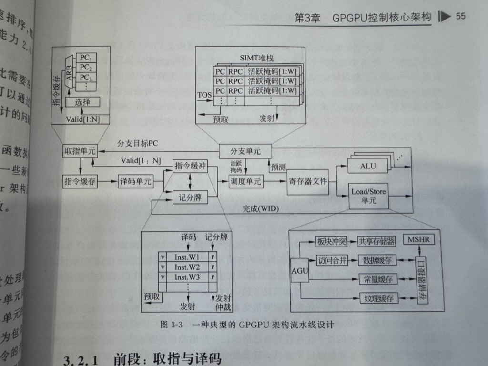

# 2 GPGPU编程模型

## 2.5 CUDA指令集概述

为了解决不同硬件之间的机器指令差异, CUDA定义了一套与底层GPGPU硬件架构基本无关, 能够跨越多种硬件的指令集及其编程模型, 即PTX(Parallel Thread Execution).

PTX由高级语言CUDA C/C++ 或者其他基于CUDA的编程语言通过nvcc编程得到, 通过JIT生成更接近GPGPU底层结构的SASS指令集.

PTX与asm格式类似, 定义了一些表示编译信息的指示标记, 存储层次标记, 数据类型标记等, 指令类似常见CPU指令.

SASS指令格式类似, 为(instruction)(destination)(source1)(source2)

# 3 GPGPU控制核心架构

## 3.1 GPGPU架构概述

- CUDA: 将所有代码、数据等从硬盘传输到内存, 再传输到显存当中
- AMD: 硬件支持统一编址, GPU可以直接访问内存
  - GDDR带宽往往更高使得这种系统会受到存储带宽的限制
  - 存储器争用导致访问延时增加

## 3.2 GPGPU指令流水线

(典型GPGPU指令流水线设计)

指令缓存与cpu cache类似减少访问慢速设备, 指令缓冲用于存储译码后等待发射的指令

调度单元通过线程束调度器(warp scheduler)选择指令缓冲中某个线程束的就绪指令发射, 调度器通过各种检测以确保指令就绪并且有空闲执行单元, 包括没有线程在等待同步栅栏或数据相关竞争

记分牌单元用于检查指令之间可能存在的相关性依赖(标记寄存器状态)

对于指令中存在条件分支的情况, 借助掩码和SIMT堆栈进行管理, 通过掩码来控制某线程是否执行

GPGPU流水线与cpu流水线类似, 不同在于GPGPU流水线以线程束为粒度, 锁步执行, 而SM内部可以有大量的线程和线程束等待运行, 使其拥有更大的调度空间来掩盖诸如缓存缺失等带来的延时, 简化缓存设计也不必设计复杂的部件来支持乱序执行以填补流水线空缺

NVIDIA线程束宽度为32, 而AMD为64, 线程束宽度增大会导致线程束数量减少影响并行度, 分支情况增加等; 宽度减少导致线程束数量增多取指访存次数增加等

## 3.3 线程分支

对于分支情况, 借助堆栈结构来支持嵌套分支, 具体地, 在每次遇到分支时(以if-else为例), 往堆栈中压入两段信息, 包含各自分支段的第一条指令PC, 整个分支结束后的下一条指令PC, 以及分支段的one-hot活跃掩码, 对于需要执行这个分支段的线程对应值为1, 这个值通过setp指令在if判断时对各自线程独有的一个特殊寄存器进行设置

整个SIMT堆栈用于维护在遇到分支时的指令执行流程, 即遇到分支则入栈, 然后按序选取一段执行并出栈, 直到再次遇到分支重复上述步骤或者堆栈清空继续顺序执行

在这个体系中会存在一个死锁情况即分支两段之间存在依赖关系, 比如第一段分支中有一个需要执行第二段分支才能退出的循环

针对此情况可以利用分支屏障和Yield指令来解决(暂略)

## 3.4 线程束调度

在编程人员看来, 线程是按照线程块指定的配置规模来组织和执行的, 从硬件角度来看, 当一个线程块被分配给一个SM后, GPGPU会根据线程的编号(TID), 将若干相邻编号的线程组织成线程束. 线程束中所有线程按照锁步方式执行, 所有线程的执行进度是一致的, 因此一个线程束可以共享一个PC

线程束中每个线程按照自己线程的TID和标量寄存器的内容来处理不同的数据. 多个线程聚集在一起就等价于向量操作, 多个线程的标量寄存器聚集在一起就等价于向量寄存器, 向量宽度即为线程束大小

这种基于线程TID的向量构造方式与传统的SIMD不同, 它不需要编程人员的参与, 因此可以看成是基于硬件的隐式SIMD或向量化. 这种方式提供了相当的灵活性, 例如线程块可以配置为256×1、16×16等多种维度, 硬件都会自动地构造出线程束来对线程块进行切分并执行

调度器每个周期都可以切换它所选择的线程束, 不同线程束的指令可能会细粒度地交织在一起, 而同一个线程束的指令则是顺序执行

由于SIMT架构的特点, 一般来讲内核函数往往存在两种数据局部性: 线程束内局部性和线程束间局部性, 一个简单的线程束调度策略可以是基于其中一种局部性, 比如侧重线程束间局部性的轮询(每次都切换线程束)和侧重线程束内局部性的贪心策略(优先执行同一束)

## 3.6 线程块分配与调度

当线程块调度器能够在某个SM上分配一个线程块所需的所有资源时, 它会创建一个线程块. 这些资源包括线程空间和寄存器, 还包括为其分配的共享存储器和同步栅栏等. 这些资源的需求都由内核函数声明, 线程块调度器会根据需求等待足够的资源, 直到在某个SM上可以分配这些资源运行一个线程块. 然后每个线程块创建各自的线程束, 等待SM内部的线程束调度器开始调度执行. 线程块调度器同时需要监控何时一个线程块的所有线程和线程束全部执行完毕退出, 释放线程块共享资源和它的线程束资源, 以便分配下一个线程块

# 4  GPGPU存储结构

## 4.1 GPGPU存储系统概述

与CPU不同, GPGPU存储系统呈现截然不同的倒三角结构

寄存器文件>>共享存储器/L1缓存>L2缓存

直到Ampere架构才将L2缓存大小大幅增加: L2>寄存器文件>L1

大量的寄存器文件可以支持线程束的零开销切换

## 4.2 寄存器文件

除了容量的需求, GPGPU的寄存器文件还需要高并行度和高访问带宽以满足线程束对操作数并行访问的需求. 假设某个线程束正在执行一条融合乘加指令(Fused-Multiply-Add, FMA), 32个线程各自需要读取3个32比特的源寄存器, 并将结果写入1个32比特的目标寄存器. 为了能够保证一个周期完成读取和写回, 要求寄存器文件每个周期至少提供96个32比特的读操作和32个32比特的写操作能力. 然而, SRAM的面积随着读写端口数目的增加而快速增大, 巨大的面积使得GPGPU寄存器文件难以采用激进的多端口设计. 为了减小GPGPU寄存器文件的面积并维持较高的操作数访问带宽, GPGPU的寄存器文件往往会采用包含有多个板块(bank)的单端口SRAM来模拟多端口的访问. 

寄存器文件将32个线程的标量寄存器打包成线程束寄存器进行统一读取和写入, 因此bank宽度为4B$\times$32, 对于同一线程束的寄存器均匀分布到各个bank中

与其它bank形式存储一样会出现bank conflict问题, 可以通过一些方法增加效率

- 1 操作数收集器

  (猜测)增加操作数收集器, 同时维护尽可能多的指令的访问请求, 从而从中挖掘更多的并行性

- 2 寄存器板块交错分布, 例:

  W0_0 W0_1 W0_2 W0_3

  W1_3 W1_0 W1_1 W1_2

  这样同时发射W0和W1的访问0号寄存器指令时可以从不同的bank并行读取

## 4.3 可编程多处理器内的存储系统

Shared Memory一共划分为32个Bank, 每个Bank的宽度为4 Bytes

当一个线程束32个线程的请求分别指向不同的bank时可以并行执行, 而当多个线程读写同一个Bank中的数据时会从并行读取变为顺序读取, 具体地, 通过仲裁器将请求拆分出无板块冲突的子集正常执行, 其余请求进行重播(退回指令流水线或者设置一个硬件暂存)

特殊的:

- 多个线程读同一个数据时, 仅有一个线程读, 然后broadcast到其他线程
- 多个线程写同一个数据时, 仅会有一个线程写成功

## 4.4 可编程多处理器外的存储系统

对全局存储器的访问也有请求合并, 但与共享存储器不同在于, 共享存储器的每一个bank都有独立的地址译码器, 所以共享存储器的请求合并只要求线程的请求分属不同板块而不需要连续地址, 全局存储器的请求合并则需要地址在DRAM中是连续的, 方便一次DRAM读写就可以完成 

具体地, GPU 会把这些访存请求打包成尽可能少的 Transaction (可以把每一个 Transaction 理解为 GPU 核心向显存发起的一次访存操作), 这个过程就叫做 Memory coalescing

Transaction 需要满足:

- 长度为 32 个 Byte

- 开始地址是 32 的倍数 

如果一个 Warp 中的第 i 个 Thread 要访问地址为 4i∼4i+3 的内存, 那么一共需要 4 个 Transaction 才能读完所有的数据

如果一个 Warp 中的第 i 个 Thread 要访问地址为 4i+1∼4i+4 的内存, 那么需要 5 个 Transaction 才能读取所有的数据

如果第 i 个 Warp 要访问地址为 32i∼32i+3 的内存, 那么就需要 32 次 Transaction 才能完成读取了

当warp中的所有线程执行load指令时, 硬件会检测它们访问的全局内存位置是否是连续的. 如果是的话, 硬件会将这些访问合并成一个对连续位置的访问

# 5 GPGPU运算单元架构

## 5.2 GPGPU的运算单元

对于常见的超越函数(正余弦除指幂对倒平方根), CUDA可以通过CUDA核心来进行高精度的计算, 也可以借助特殊功能单元进行快速的近似计算

一般快速近似计算函数是在精确计算版本函数前加上"__"作为前缀, 或者使用"--use_fast_math"编译命令

# 6 GPGPU张量核心架构

